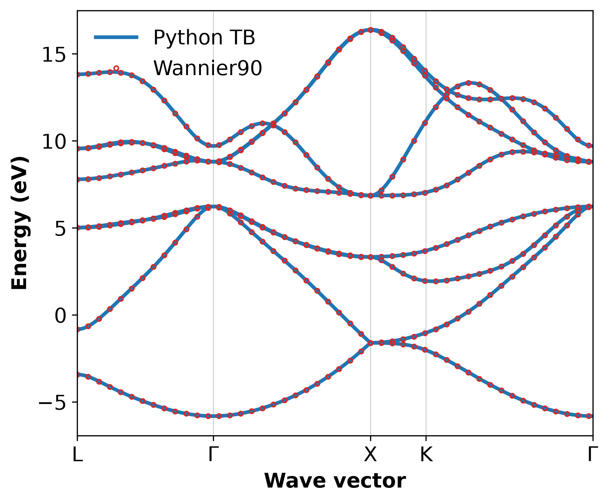

# Silicon disentangled sp3 tight-binding model

## Goal and provenance

Reproduce the eight-Wannier-function manifold of official Wannier90 tutorial 3 and check the Python Fourier evaluator against native Wannier90 with **`use_ws_distance=true`**. This tests numerical agreement for one model; it does not measure independent DFT interpolation accuracy.

Unmodified `.amn`, `.mmn` and `.eig` data come from [Wannier90 v4.0.3 tutorial03](https://github.com/wannier-developers/wannier90/tree/v4.0.3/tutorials/tutorial03), commit `971c8b64bfe703c747a52655e1d59936597fe8ea`. See [provenance.json](provenance.json) for SHA-256 hashes, adaptations and measured results, and [LICENSE.wannier90](../LICENSE.wannier90) for upstream licensing.

The overlap matrix is stored losslessly as `silicon.mmn.xz`. The runner decompresses it into the run directory; the recorded upstream hash applies to the original `.mmn` bytes. All input matrices are bundled, so running the examples needs no network access.

- Diamond silicon, actual conventional lattice constant **5.397600 Å**.
- Twelve DFT bands: four occupied plus eight unoccupied; target dimension eight.
- Atom-centered `Si:sp3` trial projectors. The final hybrid Wannier charge centers are displaced from the atoms.
- Full Gamma-centered 4×4×4 mesh, 64 points.
- Frozen maximum **6.4 eV**, outer maximum **17.0 eV**, on this dataset's eigenvalue zero. These numbers are not universal silicon settings.
- Explicit localization convergence: `conv_window=3`, `conv_tol=1e-10`, up to 300 iterations. Disentanglement uses the original settings. The old tutorial uses 50 fixed localization iterations and unshifted interpolation.

## Run and inspect

Run from the repository root after building Wannier90 as described in [the skill](../../SKILL.md). Choose an empty output directory:

```bash
venv/run cpu python skills/mat-wannier-tight-binding/scripts/run_example.py silicon-sp3 \
  --wannier90 "$PWD/.agents/test/wannier90-build/install/bin/wannier90.x" \
  --output-dir "$PWD/.agents/test/silicon-wannier-example" --plot
```

For an existing installation, substitute its executable path. The runner performs Wannierization, requires native convergence, extracts the Hamiltonian and orbital-pair distances, compares Python interpolation with the freshly generated Wannier90 bands, and writes PNG/SVG plots. Outputs stay in the selected run directory; it does not run QE.

The `analysis/` directory contains `wout_summary.json`, `tb_hamiltonian.json`, `tb_hoppings.csv`, band data and coordinates, `band_comparison.json`, plots, and the parameters of every analysis stage in `input_configs.yaml`. `execution.json` records input hashes and the executable version.

To analyze the bundled output without an external executable:

```bash
venv/run cpu python skills/mat-wannier-tight-binding/scripts/interpolate_bands.py \
  skills/mat-wannier-tight-binding/examples/silicon-sp3/silicon_hr.dat \
  --kpoints skills/mat-wannier-tight-binding/examples/silicon-sp3/silicon_band.kpt \
  --ref-bands skills/mat-wannier-tight-binding/examples/silicon-sp3/silicon_band.dat \
  --max-error 5e-5 --output-dir .agents/test/silicon-wannier-analysis
```

The matching `_wsvec.dat` and reference `.kpt` are required and found automatically.

## Verified results

| Spread component, Ų | Official tutorial solution, rounded | v4.0.3 regression output | Verified run |
|---|---:|---:|---:|
| Total | 14.500 | 14.499574503 | 14.499574503 |
| Omega I | 11.849 | 11.849193709 | 11.849193709 |
| Omega OD | 2.545 | 2.544910551 | 2.54491055 |
| Omega D | 0.105 | 0.105470243 | 0.10547024 |

Both native convergence criteria are satisfied. Rounding in the tutorial table is not a source of micro-Ų precision. The model has eight orbitals, 93 folded R vectors, on-site energies around **6.0642 eV**, and maximum folded intercell hopping around **1.5685 eV**. These energies depend on the dataset's energy zero and Wannier gauge.

The modern Wigner–Seitz interpolation comparison spans **380 points × 8 bands** along L–Gamma–X–K–Gamma:

| Metric against the same model evaluated by Wannier90 | Measured value |
|---|---:|
| MAE | 3.5882e-6 eV = 0.00359 meV |
| RMSE | 4.7164e-6 eV = 0.00472 meV |
| Maximum error | 2.4817e-5 eV = 0.02482 meV |

Small differences include text-file rounding. This is a **same-model regression**, not a comparison against independent DFT eigenvalues. For DFT accuracy, use off-mesh calculations and converge mesh, windows and the target observable as described in the skill.



[Download the vector plot](silicon_tb_bands.svg).

The archived `silicon_legacy_band.dat` is the earlier local fixed-iteration, `use_ws_distance=false` result. It supports a regression test of the legacy Fourier convention. It must not be substituted for the modern reference while retaining the modern sidecar. The two conventions differ away from the original mesh.

## References

1. I. Souza, N. Marzari and D. Vanderbilt, "Maximally localized Wannier functions for entangled energy bands", *Phys. Rev. B* **65**, 035109 (2001). [DOI](https://doi.org/10.1103/PhysRevB.65.035109); [open paper](https://arxiv.org/abs/cond-mat/0108084). This establishes the disentanglement method and includes silicon; the exact numbers above come from the tutorial dataset.
2. [Official tutorial 3 solution](https://wannier90.readthedocs.io/en/latest/tutorial_solutions/tutorial_solution_3/), source of the rounded spread column.
3. [Versioned v4.0.3 regression output](https://raw.githubusercontent.com/wannier-developers/wannier90/v4.0.3/test-suite/tests/testw90_example03/benchmark/silicon.wout), source of the full-precision benchmark column.
4. G. Pizzi et al., *J. Phys.: Condens. Matter* **32**, 165902 (2020), software reference. [DOI](https://doi.org/10.1088/1361-648X/ab51ff).
